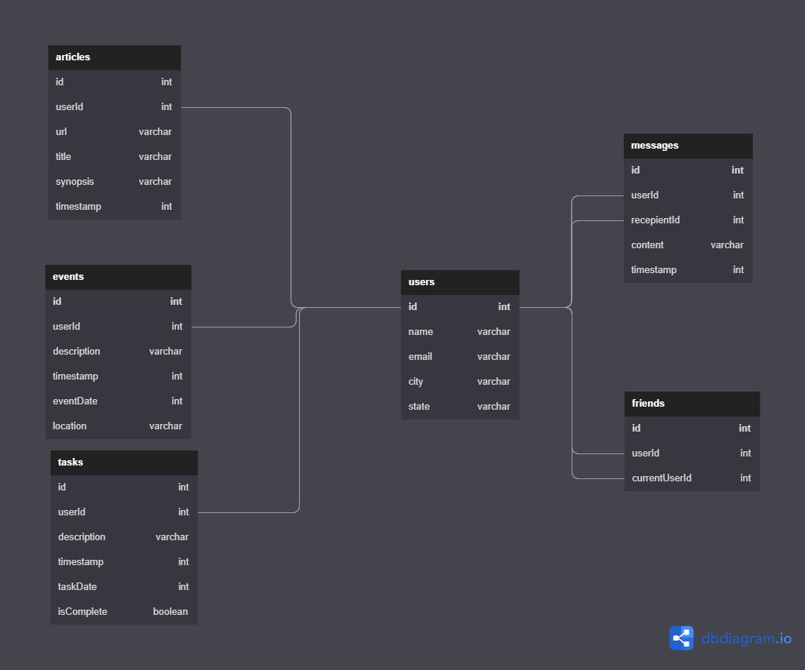

# Nutshell Slippin & Slidin Penguins!

- The goal of this project was to build our first react application that allows a user to add friends, message in a public chat room, create tasks, events, and articles. We use JSON to store information on the users as well as what they create, we were limited to creating content to fulfil certain issue tickets under a time-constraint so we could not finish the styling for the website, but all requested functionality is implemented.
- ### Tech Stack
  - <nobr>

## Wireframes:

   

## ERD:

## Instructions For Viewing

1. Navigate to the directory in which you want Nutshell to reside.
1. run `git clone`
1. run `npm install` for dependencies.
1. run `npm start`
1. for errors, look into getting an openWeather API key, and make sure your database is correct according to the ERD.

## Contributors

1. https://github.com/JavontaeH
2. https://github.com/MasterBlaster3
3. https://github.com/rushayhays
4. https://github.com/siprachanh
